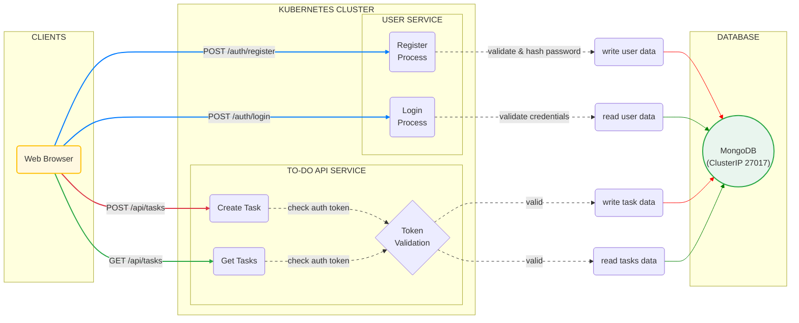

# Secure-To-Do-List-App


A multi-user to-do list application built with a full microservice architecture, containerized with Docker, and orchestrated with Kubernetes.

## Features

* **User Authentication:** Secure user registration and login system.
* **Password Security:** Passwords are never stored in plain text; they are securely hashed using `bcrypt`.
* **Token-Based API:** A stateless REST API secured with JSON Web Tokens (JWTs).
* **Private To-Do Lists:** Each user can only view and manage their own tasks.
* **Persistent Storage:** All user and task data is stored in a MongoDB database that persists across application restarts.

## Tech Stack & Architecture

This project is a demonstration of a cloud-native application using a decoupled, microservice-based design.

* **Frontend (`todo-frontend`):**
    * A simple, static user interface built with HTML and vanilla JavaScript.
    * Served by a lightweight **NGINX** web server.

* **Backend Services:**
    * **User Service (`user-service`):** A **Python/Flask** microservice responsible for user registration and login. It issues JWTs upon successful authentication.
    * **To-Do API Service (`todo-api`):** A **Python/Flask** microservice that provides the core REST API for managing tasks. It validates JWTs on all incoming requests to ensure security.

* **Database:**
    * **MongoDB:** A NoSQL database used to store all user and task data. It runs as a `StatefulSet` in Kubernetes for stability and persistence.

* **Infrastructure:**
    * **Docker:** All three services are containerized using multi-stage Dockerfiles.
    * **Kubernetes:** The entire application stack is deployed and managed by Kubernetes.
    * **Minikube:** Used for running the local Kubernetes cluster.
    * **NGINX Ingress:** Acts as an API Gateway, routing all incoming traffic to the appropriate microservice based on the URL path.

## Prerequisites

Before you begin, ensure you have the following tools installed:
* [Docker Desktop](https://www.docker.com/products/docker-desktop/)
* [Minikube](https://minikube.sigs.k8s.io/docs/start/)
* [kubectl](https://kubernetes.io/docs/tasks/tools/install-kubectl-windows/)

## How to Run Locally

1.  **Clone the Repository**
    ```bash
    git clone [https://github.com/rrithvik17/Secure-To-Do-List-App.git](https://github.com/rrithvik17/Secure-To-Do-List-App.git)
    cd Secure-To-Do-List-App
    ```

2.  **Build and Push the Docker Images**
    You must be logged into your Docker Hub account (`docker login`). Replace `your-dockerhub-username` with your actual username in the commands and the `all-in-one.yaml` file.

    ```bash
    # Build and push the User Service
    cd user-service
    docker build -t your-dockerhub-username/user-service:v1-final .
    docker push your-dockerhub-username/user-service:v1-final
    cd ..

    # Build and push the To-Do API Service
    cd todo-api
    docker build -t your-dockerhub-username/todo-api:v1-final .
    docker push your-dockerhub-username/todo-api:v1-final
    cd ..

    # Build and push the Frontend
    cd todo-frontend
    docker build -t your-dockerhub-username/todo-frontend:v1-final .
    docker push your-dockerhub-username/todo-frontend:v1-final
    cd ..
    ```

3.  **Start Minikube**
    ```bash
    minikube start
    ```

4.  **Apply the Kubernetes Manifest**
    This single command will deploy the entire application stack.
    ```bash
    cd kubernetes
    kubectl apply -f all-in-one.yaml
    ```

5.  **Enable the Ingress Addon**
    ```bash
    minikube addons enable ingress
    ```
    Wait a minute for the Ingress controller to start. You can check its status with `kubectl get pods -n ingress-nginx`.

6.  **Start the Minikube Tunnel**
    Open a **new, dedicated terminal** and run the following command. Leave this terminal open.
    ```bash
    minikube tunnel
    ```
7.  **Connect the Ingress to Minikube**
    Open a **new, dedicated terminal** and run the following command. Leave this terminal open.
    ```bash
    minikube service ingress-nginx-controller --url -n ingress-nginx
    ```
8.  **Access the Application**
    Open another new terminal and get your cluster's IP address.
    ```bash
    minikube ip
    ```
    Open your web browser and navigate to the IP address provided (e.g., `http://127.0.0.1:44131`).

## Architectural Diagram

This diagram illustrates the flow of a request from the user's browser through the Kubernetes cluster to the backend services.



## API Endpoints

The application exposes the following REST API endpoints, which are routed by the Ingress gateway to the appropriate microservice:

| Method | Endpoint          | Description                                    |
| :----- | :---------------- | :--------------------------------------------- |
| POST   | `/auth/register`  | Registers a new user account.                  |
| POST   | `/auth/login`     | Logs in an existing user and returns a JWT.    |
| GET    | `/api/tasks`      | Retrieves all tasks for the authenticated user. |
| POST   | `/api/tasks`      | Creates a new task for the authenticated user. |

**Note:** Endpoints beginning with `/api` are secure and require a valid JSON Web Token (JWT) to be included in the request header: `Authorization: Bearer <token>`.

## Future Enhancements

-   **Establish a CI/CD Pipeline:** Automate the build and deployment process using tools like GitHub Actions.
-   **Integrate Monitoring and Observability:** Add Prometheus and Grafana to monitor the health and performance of the microservices.
-   **Secure the Ingress with TLS:** Implement `cert-manager` to automatically provision SSL/TLS certificates and enable HTTPS.
-   **Refine the Frontend:** Migrate the frontend to a modern framework like React or Vue for a more dynamic user experience.
